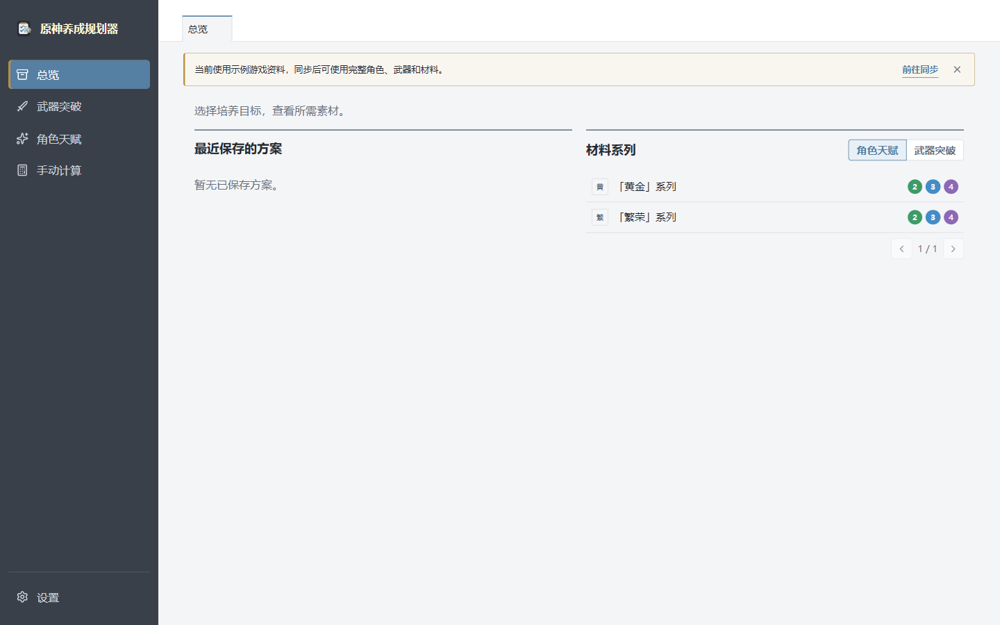

# 原神养成规划器

<p align="center">
  <a href="https://github.com/kumasuke120/genshin-planner/actions/workflows/ci.yml"></a>
</p>

<p align="center">
  
</p>



## 使用方法

1. 打开“设置 > 游戏资料”，点击“同步 Lunaris”下载完整游戏资料；内置示例资料也可以直接体验基本流程。
2. 从侧栏进入“角色天赋”或“武器突破”，选择培养对象和目标等级。
3. 在材料表中填写当前库存，按需选择合成角色，查看合成后可用数量和材料缺口。
4. 点击“保存方案”保留培养目标；已保存方案可以从总览或“设置 > 我的方案”重新打开。
5. 临时核算单个材料系列时使用“手动计算”，该页面不保存方案。

## 编译

需要 Node.js 20 或更高版本。

```bash
npm ci
npm run build
```

本地开发：

```bash
npm run dev
```

完整验证：

```bash
npm run verify
npm run test:e2e
npm run test:visual
```

生成 Windows 绿色 ZIP：

```bash
npm run package
```
